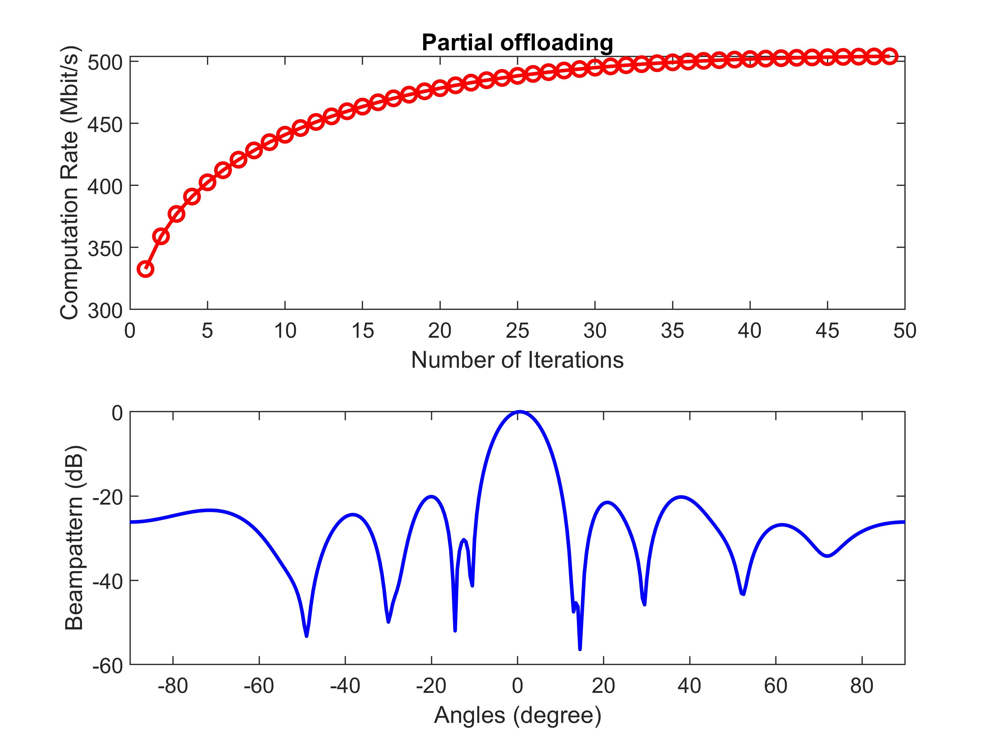
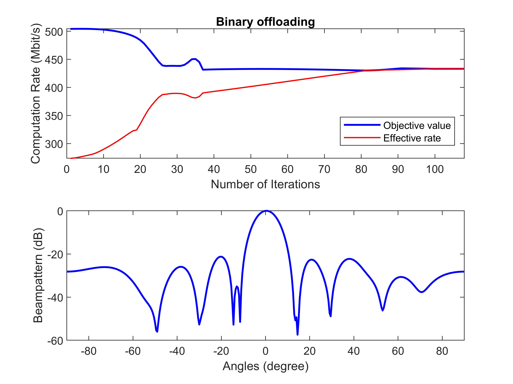

# NOMA-aided Joint Communication, Sensing, and Multi-tier Computing Systems

The code for the paper 
**Z. Wang, X. Mu, Y. Liu, X. Xu, and P. Zhang, “NOMA-aided Joint Communication, Sensing, and Multi-tier Computing Systems,” *IEEE J. Sel. Areas Commun.*, vol. 41, no. 3, pp. 574-588, Mar. 2023, doi: 10.1109/JSAC.2022.3229447.** [[IEEE](https://ieeexplore.ieee.org/document/9996408)] [[Arxiv](https://arxiv.org/abs/2205.08272)]

## Running the simulations

### Prerequisites

- [MATLAB](https://uk.mathworks.com/products/matlab.html)
- [CVX](http://cvxr.com/cvx/)

### Launch

Run `main.m`

### Expected Results

#### Partial Offloading


#### Binary Offloading


## Citing
If you in any way use this code for research, please cite our original article listed above. The corresponding BiBTeX citation is given below:
```
@article{wang2022noma,
  title={{NOMA}-aided Joint Communication, Sensing, and Multi-tier Computing Systems},
  author={Wang, Zhaolin and Mu, Xidong and Liu, Yuanwei and Xu, Xiaodong and Zhang, Ping},
  journal={{IEEE} J. Sel. Areas Commun.},
  year={2023},
  month=mar,
  volume={41},
  number={3},
  pages={574-588}
}
```
